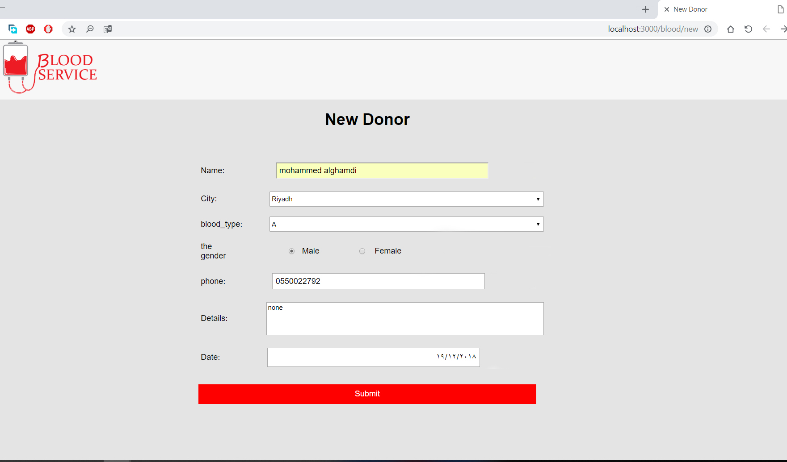

# Blood-Donation

The Ojective of this website : to coordinate between the donor and the patient who needs blood transfusion
Our responsibilities are to: Encourage people to donate blood and help each other Provide easy way to find the appropriate blood
I used PostgreSQL,JavaScript,Node.js,HTML5 and CSS 

### Homepage

### The Dashboard contains the following : 
1-Number of Volunteers in both genders based on ABO blood group system.
2-Number of Volunteers in each city
3-Number of Volunteers per month in 2018
4-Total Number of Volunteers 

### Registration of a new donor

 ### Search for a blood donor according to the blood type required

### Search results for donors

### You can update your registration data

