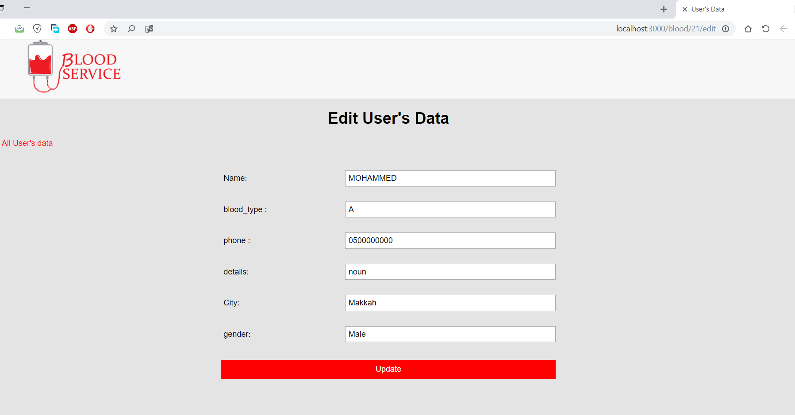

# Blood-Donation

The Ojective of this website : to coordinate between the donor and the patient who needs blood transfusion. 
Our responsibilities are to: Encourage people to donate blood and help each other Provide easy way to find the appropriate blood. 
I used PostgreSQL, JavaScript, Node.js, HTML5 and CSS to build this Web application. 
### Homepage

### The Dashboard consist of :
 1-Number of Volunteers in both genders based on ABO blood group system. 
 2-Number of Volunteers in each city. 
 3-Number of Volunteers per month in 2018. 
 4-Total Number of Volunteers. 

###  new donor Registration

 ### Search for blood donor according to blood types and citys

### Search results for donors

### You can update your registration data

